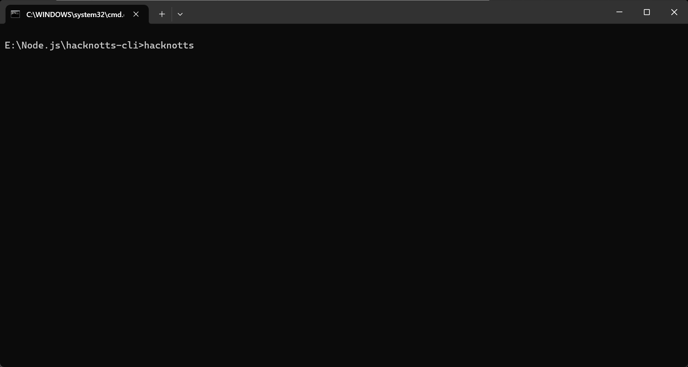

# hacknotts-cli



> An interactive AI-powered command-line interface for HackNotts 2025 - Chat with multiple AI providers through an elegant terminal interface.

## Overview

**hacknotts-cli** is a sophisticated AI interaction tool that brings multiple AI providers to your terminal. Built with React and Ink, it provides a beautiful, interactive chat experience with support for 10+ AI providers, an extensible plugin system, and MCP (Model Context Protocol) integration.

## Features

- **Multi-Provider Support** - Seamlessly switch between OpenAI, Anthropic, Google, xAI, DeepSeek, Azure, OpenRouter, and more
- **Interactive Terminal UI** - Beautiful React-based interface powered by Ink with animations and streaming responses
- **Context-Aware AI** - Automatic HACKNOTTS.md context loading for project-specific conversations
- **Extensible Plugin System** - Pre/post hook architecture with built-in plugins for tools, web search, and logging
- **Built-in Commands** - `/help`, `/provider`, `/export`, `/model`, `/init`, `/about`, and more
- **Chat History Export** - Save conversations to JSON or Markdown formats
- **MCP Integration** - Built-in tools for fetch, filesystem, memory, time, and sequential thinking
- **Provider Dashboard** - Visual provider status with easy switching and configuration
- **Streaming Responses** - Real-time message streaming from AI models with animated display
- **Configuration Persistence** - Save preferences, default provider, and working directory
- **Working Directory Management** - Change context with `/cd` command for file operations
- **Beautiful Animations** - Gradient effects, loading spinners, and smooth transitions
- **Full TypeScript Support** - Type-safe development experience across all packages

## Installation

```bash
git clone https://github.com/Pleasurecruise/hacknotts-cli.git
cd hacknotts-cli
npm install
npm run build
```

The CLI will be installed globally as `hacknotts` command.

## Quick Start

1. **Configure your API keys** - Create a `.env` file in the project root:

```env
# OpenAI
OPENAI_API_KEY=your-openai-api-key
OPENAI_MODEL=gpt-4

# Anthropic
ANTHROPIC_API_KEY=your-anthropic-api-key
ANTHROPIC_MODEL=claude-3-5-sonnet-20241022

# Google
GOOGLE_API_KEY=your-google-api-key
GOOGLE_MODEL=gemini-1.5-pro

# DeepSeek
DEEPSEEK_API_KEY=your-deepseek-api-key
DEEPSEEK_MODEL=deepseek-chat

# Add other providers as needed
```

2. **Run the CLI**:

```bash
hacknotts
```

3. **Start chatting**:

```
Welcome to the HackNotts 2025 CLI!

> hi
Hello! How can I assist you with your HackNotts 2025 project submission today?

> /help
Available commands:
  /help (h, ?)          - Show this help message
  /provider (p)         - Switch AI provider
  /model (m)            - Switch model
  /export (save)        - Export chat history
  /clear (cls, c)       - Clear chat
  /exit (quit, q)       - Exit application
```

## Available Commands

| Command | Aliases | Description |
|---------|---------|-------------|
| `/help` | `h`, `?` | Show available commands |
| `/provider` | `p`, `providers` | Open provider dashboard to switch providers |
| `/model <name>` | `m` | Temporarily switch to a specific model |
| `/export [format]` | `save`, `download` | Export chat history (json or markdown) |
| `/clear` | `cls`, `c` | Clear chat history |
| `/cd <path>` | `chdir` | Change working directory |
| `/init` | `initialize` | Initialize HACKNOTTS.md context file in current directory |
| `/about` | `info` | Show application information and credits |
| `/exit` | `quit`, `q` | Exit the application |

## Supported AI Providers

hacknotts-cli supports the following AI providers:

- **OpenAI** - GPT-4, GPT-3.5, and custom models
- **Anthropic** - Claude 3.5 Sonnet, Claude 3 Opus/Haiku
- **Google** - Gemini 1.5 Pro/Flash
- **xAI** - Grok models
- **DeepSeek** - DeepSeek Chat
- **Azure OpenAI** - Azure-hosted OpenAI models
- **OpenRouter** - Access to multiple models through OpenRouter
- **OpenAI Compatible** - Custom endpoints compatible with OpenAI API

Each provider can be configured with:

- API keys
- Custom base URLs
- Default models
- Provider-specific options

## HACKNOTTS.md Context System

The CLI features an intelligent context loading system through `HACKNOTTS.md` files:

### Automatic Context Loading

When you start a chat session, the CLI automatically searches for and loads `HACKNOTTS.md` from:
1. Current working directory
2. Parent directories (up to repository root)

This provides AI assistants with crucial project context, including:
- Project overview and goals
- Technology stack
- Current status and progress
- Team information
- Important notes and decisions

### Creating a Context File

Use the `/init` command to generate a template:

```bash
> /init
Created HACKNOTTS.md in /your/project/path
```

The generated template includes sections for:
- Project Overview
- Technology Stack  
- Project Goals
- Current Status (Completed/In Progress/TODO)
- Important Notes
- Team Members

### Benefits

- **Better AI Understanding** - AI gets full context about your project
- **Consistent Responses** - All team members' AI interactions use same context
- **Progress Tracking** - Keep your project status documented
- **Seamless Collaboration** - Share project knowledge across the team

## Configuration

### Environment Variables

Configure providers through `.env` file:

```env
# Provider API Keys
OPENAI_API_KEY=sk-...
ANTHROPIC_API_KEY=sk-ant-...
GOOGLE_API_KEY=...
XAI_API_KEY=...
DEEPSEEK_API_KEY=...
AZURE_OPENAI_API_KEY=...

# Custom Models (optional)
OPENAI_MODEL=gpt-4
ANTHROPIC_MODEL=claude-3-5-sonnet-20241022
GOOGLE_MODEL=gemini-1.5-pro

# Custom Endpoints (optional)
OPENAI_BASE_URL=https://api.openai.com/v1
```

### User Configuration

User preferences are stored in `~/.hacknotts-cli/config.json`:

```json
{
  "defaultProvider": "openai",
  "defaultModel": "gpt-4",
  "theme": "default",
  "workingDirectory": "/path/to/project"
}
```

Configuration is automatically managed by the CLI:

- **Default Provider** - Set via provider dashboard or `/provider` command
- **Default Model** - Persists your preferred model for each provider
- **Working Directory** - Saved when using `/cd` command for persistent context

### Advanced Provider Configuration

For custom or self-hosted providers:

```env
# OpenAI Compatible Provider
OPENAI_COMPATIBLE_API_KEY=your-key
OPENAI_COMPATIBLE_BASE_URL=https://your-endpoint.com/v1
OPENAI_COMPATIBLE_MODEL=your-model

# Azure OpenAI
AZURE_OPENAI_API_KEY=your-azure-key
AZURE_OPENAI_RESOURCE_NAME=your-resource-name
AZURE_OPENAI_DEPLOYMENT_NAME=your-deployment
AZURE_OPENAI_API_VERSION=2024-02-15-preview

# OpenRouter
OPENROUTER_API_KEY=your-openrouter-key
OPENROUTER_MODEL=anthropic/claude-3.5-sonnet
```

## Plugin System

hacknotts-cli features an extensible plugin architecture:

### Plugin Hooks

Plugins can implement various hooks:

- **First-Hook** - `resolveModel`, `loadTemplate` (returns first valid result)
- **Sequential-Hook** - `configureContext`, `transformParams`, `transformResult` (chain transformations)
- **Parallel-Hook** - `onRequestStart`, `onRequestEnd`, `onError` (side effects)
- **Stream-Hook** - `transformStream` (stream processing)

### Built-in Plugins

The CLI includes several pre-built plugins:

#### Tool Use Plugin
Enables AI models to use tools and execute functions during conversations. Configure with `createPromptToolUsePlugin` to add custom tool capabilities.

#### Web Search Plugin
Integrates web search capabilities with provider-specific configurations:
- OpenAI web search
- Anthropic web search
- Google search
- xAI search
- OpenRouter search

#### Google Tools Plugin
Provides access to Google-specific tools and integrations for enhanced functionality with Gemini models.

#### Logging Plugin
Adds comprehensive logging capabilities for debugging and monitoring AI interactions. Track requests, responses, and errors with customizable log levels.

### Middleware System

The plugin system is built on a flexible middleware architecture:

- **Named Middlewares** - Organize and manage multiple middleware layers
- **Middleware Wrapping** - Apply transformations to model inputs/outputs
- **Chain Processing** - Sequential middleware execution with context passing
- **Error Handling** - Graceful error catching and recovery

### Creating Custom Plugins

Use `definePlugin` to create your own plugins:

```typescript
import { definePlugin } from '@cherrystudio/ai-core'

const myPlugin = definePlugin({
  id: 'my-custom-plugin',
  name: 'My Custom Plugin',
  hooks: {
    configureContext: async (context) => {
      // Modify request context
      return context
    },
    transformResult: async (result, context) => {
      // Transform AI response
      return result
    }
  }
})
```

### MCP Integration

Built-in MCP tools for extended functionality:

- **Fetch Tool** - Make HTTP requests with custom headers and authentication
- **Filesystem Tool** - Read, write, list, and manage files in the workspace
- **Memory Tool** - Persistent key-value storage for cross-session data
- **Time Tool** - Get current time, timezone info, and format timestamps
- **Sequential Thinking Tool** - Multi-step reasoning with memory and session management

### MCP Server Integration

The toolkit package provides MCP server capabilities:

- **Server Management** - Start and manage MCP servers
- **Tool Discovery** - Automatically discover available tools from servers
- **Tool Execution** - Execute tools with proper parameter validation
- **Session Handling** - Manage persistent sessions across interactions

Create custom MCP plugins with `createMcpPlugin`:

```typescript
import { createMcpPlugin } from 'toolkit'

const mcpPlugin = createMcpPlugin({
  enabled: true,
  servers: [
    {
      name: 'my-server',
      command: 'node',
      args: ['server.js']
    }
  ]
})
```

## Export Functionality

Export your chat history in multiple formats:

```bash
# Export to JSON
> /export json

# Export to Markdown
> /export markdown

# Default export (JSON)
> /export
```

Exported files include:

- Full message history
- Timestamps
- Role indicators
- Message metadata

## User Interface Features

### Terminal Animations

The CLI includes several visual enhancements for a premium user experience:

- **Animated Logo** - Smooth logo animation on startup with gradient effects
- **Loading Spinners** - Context-aware loading indicators during AI processing
- **Gradient Effects** - Beautiful animated gradients throughout the interface
- **Smooth Transitions** - Fluid view transitions between chat, help, and provider dashboard
- **Real-time Streaming** - Character-by-character display of AI responses

### Interactive Components

- **Provider Dashboard** - Navigate through providers with keyboard controls (↑/↓ arrows)
- **Command List** - Searchable command list with syntax highlighting
- **Status Bar** - Persistent status display showing current provider, model, and working directory
- **Help System** - Comprehensive help view with command documentation and examples
- **About View** - Application information, version, and credits

### Keyboard Controls

- **Ctrl+C** - Interrupt current AI generation or cancel input
- **↑/↓** - Navigate command history or provider list
- **Tab** - Command auto-completion (when available)
- **Esc** - Close modal views (help, provider dashboard, about)

## Development

### Project Structure

```plaintext
hacknotts-cli/
├── packages/
│   ├── cli/              # Main CLI application
│   │   ├── src/
│   │   │   ├── index.tsx # Entry point
│   │   │   ├── app.tsx   # Main app component
│   │   │   ├── components/
│   │   │   │   ├── ChatSession.tsx      # Main chat session logic
│   │   │   │   ├── ChatInterface.tsx    # Chat UI component
│   │   │   │   ├── ProviderView.tsx     # Provider dashboard
│   │   │   │   ├── HelpView.tsx         # Help command view
│   │   │   │   ├── AboutView.tsx        # About information
│   │   │   │   ├── StatusBar.tsx        # Status display
│   │   │   │   ├── LoadingSpinner.tsx   # Loading animation
│   │   │   │   ├── LogoAnimation.tsx    # Logo with animations
│   │   │   │   └── AnimatedGradient.tsx # Gradient effects
│   │   │   ├── commands/
│   │   │   │   ├── CommandRegistry.ts   # Command system
│   │   │   │   └── builtInCommands.ts   # Built-in commands
│   │   │   ├── services/
│   │   │   │   ├── aiService.ts         # AI provider service
│   │   │   │   └── configService.ts     # Configuration management
│   │   │   └── utils/
│   ├── aiCore/           # AI provider and plugin system
│   │   ├── src/
│   │   │   ├── core/
│   │   │   │   ├── providers/           # Provider implementations
│   │   │   │   ├── plugins/             # Plugin system
│   │   │   │   │   └── built-in/        # Built-in plugins
│   │   │   │   ├── middleware/          # Middleware architecture
│   │   │   │   ├── models/              # Model resolution
│   │   │   │   ├── options/             # Provider options
│   │   │   │   └── runtime/             # Execution runtime
│   └── toolkit/          # MCP utilities
│       └── src/
│           ├── manager.ts   # MCP manager
│           ├── plugin.ts    # MCP plugin integration
│           ├── servers/     # MCP server implementations
│           └── tools/       # Built-in MCP tools
├── docs/
├── .env                  # Provider configuration
└── package.json
```

### Architecture

**Three-Layer Design:**

1. **CLI Layer** (`packages/cli`) - User interface, commands, and interaction logic
2. **AI Core Layer** (`packages/aiCore`) - Provider abstraction, plugin system, and execution runtime
3. **Toolkit Layer** (`packages/toolkit`) - MCP integration and tool implementations

### Build Commands

```bash
# Development with watch mode
npm run dev

# Production build
npm run build

# Run tests
npm test

# Lint and format
npm run lint
npm run format
```

### Testing

```bash
# Run tests once
npm test

# Watch mode
npm run test:watch
```

## Usage Examples

### Basic Conversation

```bash
> What is the capital of France?
The capital of France is Paris.

> /model gpt-3.5-turbo
✓ Switched to model: gpt-3.5-turbo

> Tell me more about it
Paris is the largest city in France and has been the country's capital since...
```

### Working with Files

```bash
> /cd ./my-project
✓ Changed working directory to: ./my-project

> Can you read the README.md file?
[AI uses filesystem tool to read and analyze README.md]

> /init
✓ Created HACKNOTTS.md in /path/to/my-project
```

### Switching Providers

```bash
> /provider
# Opens provider dashboard
# Use ↑/↓ to navigate, Enter to select

> Tell me a joke
[Response from newly selected provider]
```

### Exporting Conversations

```bash
> This is important information I want to save

> /export markdown
✓ Exported 12 messages to chat-history-2025-10-26.md (MARKDOWN)

> /export json
✓ Exported 12 messages to chat-history-2025-10-26.json (JSON)
```

## Best Practices

### For Developers

1. **Use HACKNOTTS.md** - Create context files for your projects to give AI better understanding
2. **Organize by Directory** - Use `/cd` to switch between project contexts
3. **Export Important Sessions** - Save breakthrough conversations with `/export`
4. **Test Multiple Providers** - Different providers excel at different tasks
5. **Leverage Plugins** - Enable web search and tools for enhanced capabilities

### For Hackathons

1. **Document as You Go** - Update HACKNOTTS.md with progress
2. **Quick Provider Switching** - Test ideas across different models
3. **Code Review** - Use AI to review and improve your code
4. **Architecture Planning** - Discuss system design with context-aware AI
5. **Debug Together** - Paste errors and get instant help

### Performance Tips

1. **API Key Management** - Keep keys in `.env`, never commit them
2. **Model Selection** - Use faster models for quick tasks, advanced models for complex problems
3. **Clear History** - Use `/clear` to free memory in long sessions
4. **Working Directory** - Set correct directory for file operations

## Requirements

- Node.js >= 22.12.0
- npm or yarn
- API keys for at least one AI provider

## Troubleshooting

### Common Issues

**CLI Not Found After Installation**

```bash
# Reinstall globally
npm run build
# Or manually link
npm link
```

**API Key Errors**

```bash
# Verify .env file exists in project root
ls -la .env

# Check environment variables are loaded
cat .env
```

**Provider Not Initializing**

- Ensure API key is valid and has correct format
- Check base URL if using custom endpoints
- Verify network connectivity
- Review model name spelling

**Streaming Issues**

- Some providers may have rate limits
- Check terminal supports ANSI colors
- Try different terminal emulator if display issues occur

**File Operation Errors**

- Verify working directory exists: `/cd /path/to/dir`
- Check file permissions
- Ensure paths are absolute or relative to working directory

### Debug Mode

Enable verbose logging by setting environment variable:

```bash
DEBUG=hacknotts:* hacknotts
```

### Getting Help

- Check `/help` for command documentation
- Review `/about` for version information
- Visit [Issues](https://github.com/Pleasurecruise/hacknotts-cli/issues) for known problems
- Join HackNotts Discord for community support

## Contributing

Contributions are welcome! This project was created for HackNotts 2025.

### Authors

- **Pleasurecruise** - [GitHub](https://github.com/Pleasurecruise)
- **IvanHanloth** - [GitHub](https://github.com/IvanHanloth)

## License

MIT License - see [LICENSE](LICENSE) file for details

## References

- [Cherry Studio](https://github.com/CherryHQ/cherry-studio) - Inspiration for the AI core architecture
- [Vercel AI SDK](https://sdk.vercel.ai/) - Underlying AI SDK
- [Ink](https://github.com/vadimdemedes/ink) - React for terminal interfaces
- [Model Context Protocol](https://modelcontextprotocol.io/) - MCP specification

## Acknowledgments

Created for **HackNotts 2025** - A hackathon project demonstrating advanced AI integration in CLI applications.

---

**Happy Hacking!** 🚀
